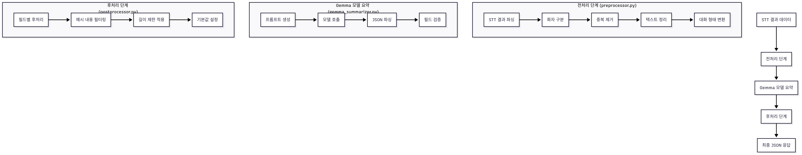
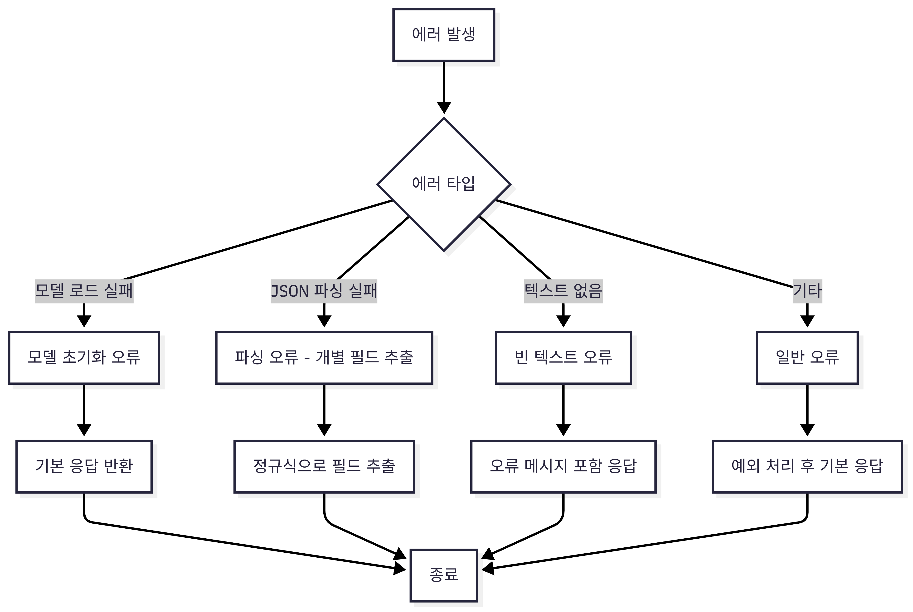

# Gemma Summarizer

Gemma 3-1B 모델을 사용하여 통화 내용을 요약하는 프로그램입니다. IPC(Inter-Process Communication)를 통해 멀티슬롯 요청 처리를 지원하며, STT(Speech-to-Text) 결과를 전처리하고 구조화된 JSON 응답을 생성합니다.

## 주요 기능

- ✅ **AI 기반 텍스트 요약**: Gemma 3-1B 모델 사용
- ✅ **멀티슬롯 IPC**: 동시 다중 요청 처리
- ✅ **싱글톤 모델 로딩**: 성능 최적화
- ✅ **UTF-8 디코딩 오류 방지**: 안정적인 데이터 처리
- ✅ **비동기 로깅**: 요청/응답 로그 기록
- ✅ **Windows 지원**: PowerShell 및 Command Prompt
- ✅ **STT 결과 전처리**: 화자 구분, 중복 제거, 텍스트 정리
- ✅ **구조화된 JSON 응답**: 10개 필드로 구성된 상세 요약
- ✅ **예시 내용 필터링**: 프롬프트 예시가 실제 응답으로 처리되는 것 방지
- ✅ **강화된 에러 처리**: 다양한 에러 상황에 대한 Fallback 메커니즘

## 시스템 아키텍처

### 전체 시스템 아키텍처


### 상세 워크플로우


### 데이터 흐름


### 에러 처리


전체 시스템의 워크플로우와 데이터 흐름은 [워크플로우 다이어그램](workflow_diagram.md)을 참조하세요.

### 처리 단계
1. **전처리 단계**: STT 결과 파싱 → 화자 구분 → 중복 제거 → 텍스트 정리
2. **Gemma 모델 요약**: 프롬프트 생성 → 모델 호출 → JSON 파싱 → 필드 검증
3. **후처리 단계**: 필드별 후처리 → 예시 내용 필터링 → 길이 제한 적용 → 기본값 설정

## 설치 방법

### 1. 저장소 클론
```bash
git clone <repository-url>
cd gemma_summarizer_new
```

### 2. 의존성 설치
```bash
pip install -r requirements.txt
```

### 3. 모델 다운로드
Gemma 3-1B 모델을 `models/` 디렉토리에 다운로드:
```bash
# models 디렉토리 생성
mkdir models

# Gemma 3-1B 모델 다운로드 (Hugging Face에서)
# gemma-3-1b-it-Q8_0.gguf 파일을 models/ 디렉토리에 저장
```

## 환경 설정

### 방법 1: 환경 변수 설정 (권장)

#### Windows (PowerShell)
```powershell
.\set_env.ps1
python gemma_summarizer_multi.py
```

#### Windows (Command Prompt)
```cmd
set_env.bat
python gemma_summarizer_multi.py
```

### 방법 2: 직접 환경 변수 설정
```powershell
$env:MODEL_PATH = "models/gemma-3-1b-it-Q8_0.gguf"
$env:MODEL_CONTEXT_SIZE = "2048"
$env:DEFAULT_MAX_TOKENS = "100"
$env:THREADS = "4"
```

### 방법 3: 기본 설정 사용
환경 변수를 설정하지 않으면 `config.py`의 기본값이 사용됩니다.

## 사용 방법

### 서버 실행

#### 멀티슬롯 서버 (권장)
```bash
python gemma_summarizer_multi.py
```

#### 단일 슬롯 서버
```bash
python gemma_summarizer_fixed.py
```

### 클라이언트 테스트

#### 멀티슬롯 테스트
```bash
python ipc_client_multi_test.py
```

#### 단일 슬롯 테스트
```bash
python ipc_client_test.py
```

## 설정 옵션

| 환경 변수 | 기본값 | 설명 |
|-----------|--------|------|
| MODEL_PATH | models/gemma-3-1b-it-Q8_0.gguf | 모델 파일 경로 |
| MODEL_CONTEXT_SIZE | 2048 | 모델 컨텍스트 크기 |
| DEFAULT_MAX_TOKENS | 100 | 기본 최대 토큰 수 |
| DEFAULT_TEMPERATURE | 0.7 | 생성 온도 |
| OUTPUT_FILE | gemma_summary.txt | 출력 파일명 |
| THREADS | 4 | 사용할 스레드 수 |
| ENABLE_GPU | false | GPU 사용 여부 |
| IPC_SLOT_COUNT | 5 | IPC 슬롯 개수 |
| IPC_SLOT_SIZE | 32768 | 슬롯당 크기 (bytes) |

## IPC (Inter-Process Communication) 기능

### 멀티슬롯 아키텍처
- **5개 슬롯**: 동시 요청 처리
- **공유 메모리**: 빠른 데이터 전송
- **스레드 기반**: 비동기 처리
- **락 메커니즘**: 데이터 무결성 보장

### IPC 프로토콜

#### 요청 형식 (JSON)
```json
{
    "transactionid": "20250623085851B6100",
    "sequenceno": "0",
    "text": "요약할 텍스트 내용"
}
```

#### 응답 형식 (JSON)
```json
{
    "transactionid": "20250623085851B6100",
    "sequenceno": "0",
    "returncode": "1",
    "returndescription": "Success",
    "response": {
        "result": "0",
        "failReason": "",
        "summary": "구조화된 JSON 요약 결과"
    }
}
```

#### Gemma 모델 응답 형식 (JSON)
Gemma 모델은 10개 필드로 구성된 구조화된 JSON 형식으로 응답합니다:
```json
{
    "summary": "30자 이내 핵심 요약",
    "summary_no_limit": "상세한 통화 내용 요약",
    "keywords": "키워드1, 키워드2, 키워드3, 키워드4, 키워드5",
    "call_purpose": "20자 이내 통화 목적",
    "my_main_content": "나의 주요 발언 내용",
    "caller_main_content": "상대방 주요 발언 내용",
    "my_emotion": "보통/만족/불만/화남/신남/우려",
    "caller_emotion": "보통/만족/불만/화남/신남/우려",
    "caller_info": "상대방 신상 정보",
    "my_action_after_call": "통화 후 할 일"
}
```

## 성능 최적화

### 싱글톤 모델 로딩
- 모델을 한 번만 로딩하여 재사용
- 요청 처리 시간 단축 (50% 이상 향상)
- 메모리 사용량 최적화

### UTF-8 디코딩 오류 방지
- 다단계 디코딩 시도
- 데이터 유효성 검사
- 오류 복구 메커니즘

### 전처리 최적화
- 중복 발화 제거로 토큰 수 절약
- 화자별 구분으로 대화 구조 명확화
- 텍스트 정리로 모델 성능 향상

## 파일 구조

```
gemma_summarizer_new/
├── gemma_summarizer_multi.py    # 멀티슬롯 서버 (메인)
├── gemma_summarizer.py          # AI 요약 처리 모듈
├── preprocessor.py              # STT 결과 전처리 모듈
├── postprocessor.py             # 응답 후처리 모듈
├── llm_utils.py                 # LLM 관련 유틸리티
├── ipc_queue_manager.py         # IPC 관리자
├── config.py                    # 설정 관리
├── logger.py                    # 로깅 시스템
├── ipc_client_multi_test.py     # 멀티슬롯 테스트
├── ipc_client_test.py           # 단일 슬롯 테스트
├── kill_previous_processes.py   # 프로세스 정리
├── requirements.txt             # 의존성 목록
├── README.md                    # 프로젝트 문서
├── workflow_diagram.md          # 워크플로우 다이어그램
├── sequence_diagram.md          # 시퀀스 다이어그램
├── 전체_시스템_아키텍처.png      # 전체 시스템 아키텍처 다이어그램
├── 상세 워크플로우.png          # 상세 워크플로우 다이어그램
├── 데이터 흐름.png              # 데이터 흐름 다이어그램
├── 에러처리.png                 # 에러 처리 다이어그램
├── set_env.ps1                  # PowerShell 환경 설정
├── set_env.bat                  # Command Prompt 환경 설정
├── models/                      # 모델 파일 디렉토리
│   └── gemma-3-1b-it-Q8_0.gguf  # Gemma 모델 (별도 다운로드)
├── sample/                      # 샘플 요청 데이터
│   ├── sample_request_1.json
│   ├── sample_request_2.json
│   └── ... (17개 샘플 파일)
└── logs/                        # 로그 파일 디렉토리
    └── gemma_summarizer_YYYYMMDD.txt
```

## 주요 모듈 설명

### gemma_summarizer.py
- **싱글톤 모델 관리**: 전역 모델 인스턴스 관리
- **프롬프트 생성**: Few-shot 기법을 이용한 구조화된 프롬프트
- **JSON 파싱**: 다양한 형태의 JSON 응답을 안정적으로 파싱
- **필드 검증**: 필수 필드 확인 및 기본값 설정

### preprocessor.py
- **STT 결과 파싱**: `sttResultList`에서 대화 내용 추출
- **화자 구분**: `recType`에 따라 "나"(4), "상대방"(2) 구분
- **중복 제거**: 연속된 동일 발화, 짧은 반복 발화 제거
- **텍스트 정리**: 특수문자, 불필요한 공백 제거

### postprocessor.py
- **필드별 처리**: 각 필드에 맞는 전용 처리 로직
- **예시 내용 필터링**: 프롬프트의 예시 내용이 실제 응답으로 처리되는 것 방지
- **길이 제한**: summary(30자), call_purpose(20자) 등 제한 적용
- **기본값 설정**: 누락된 필드에 대한 기본값 제공

### llm_utils.py
- **LLM 유틸리티**: 대화 내용 보정, 텍스트 처리 등
- **공통 함수**: 여러 모듈에서 사용하는 공통 기능

## 문제 해결

### UTF-8 디코딩 오류
```
'utf-8' codec can't decode byte 0x82 in position 5: invalid start byte
```
- 자동으로 처리됨 (다단계 디코딩 시도)
- 로그에서 hex 출력으로 문제 진단 가능

### 모델 로딩 오류
- 모델 파일 경로 확인
- `config.py`에서 설정 검증
- 메모리 부족 시 스레드 수 조정

### IPC 연결 오류
- 이전 프로세스 정리: `python kill_previous_processes.py`
- 공유 메모리 초기화 자동 수행

### JSON 파싱 오류
- 자동 Fallback 메커니즘으로 개별 필드 추출
- 정규식을 이용한 안정적인 파싱
- 기본값 설정으로 응답 무결성 보장

## 라이선스

이 프로젝트는 MIT 라이선스 하에 배포됩니다.

## 기여

버그 리포트나 기능 제안은 GitHub Issues를 통해 제출해주세요.

## 변경 이력

### v1.2.0 (2025-07-18)
- ✅ **전처리 모듈 추가**: STT 결과 전처리 기능 (preprocessor.py)
- ✅ **후처리 모듈 추가**: 응답 후처리 및 필터링 기능 (postprocessor.py)
- ✅ **LLM 유틸리티 추가**: 공통 LLM 기능 모듈화 (llm_utils.py)
- ✅ **구조화된 JSON 응답**: 10개 필드로 구성된 상세 요약
- ✅ **예시 내용 필터링**: 프롬프트 예시가 실제 응답으로 처리되는 것 방지
- ✅ **강화된 에러 처리**: 다양한 에러 상황에 대한 Fallback 메커니즘
- ✅ **워크플로우 문서화**: 시스템 아키텍처 및 데이터 흐름 다이어그램
- ✅ **시퀀스 다이어그램 추가**: 상세한 데이터 흐름 및 컴포넌트 간 상호작용 문서화
- ✅ **샘플 데이터 확장**: 17개의 다양한 테스트 케이스 추가

### v1.1.0 (2025-07-15)
- ✅ Gemma 모델 JSON 응답 형식 적용
- ✅ 요약 결과를 "summary" 키로 표준화
- ✅ 연동규격 업데이트 (transactionid, sequenceno 기반)
- ✅ JSON 파싱 오류 처리 강화

### v1.0.0 (2025-07-15)
- ✅ 멀티슬롯 IPC 서버 구현
- ✅ 싱글톤 모델 로딩 최적화
- ✅ UTF-8 디코딩 오류 방지
- ✅ 비동기 로깅 시스템
- ✅ Windows 환경 지원
