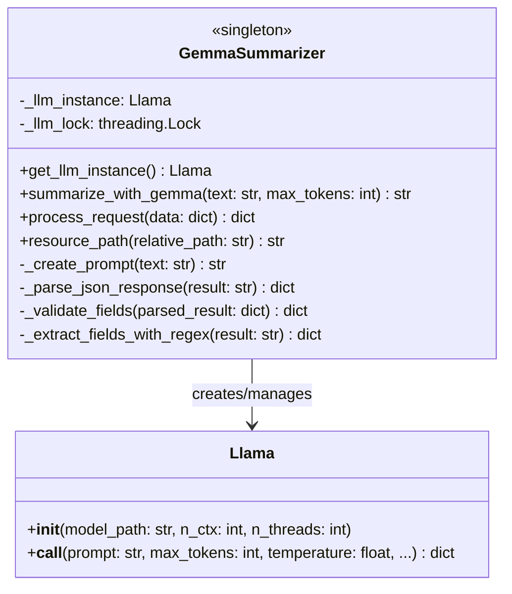
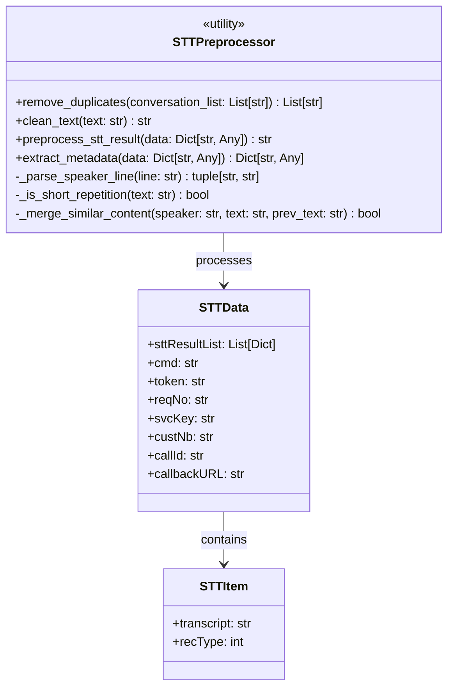
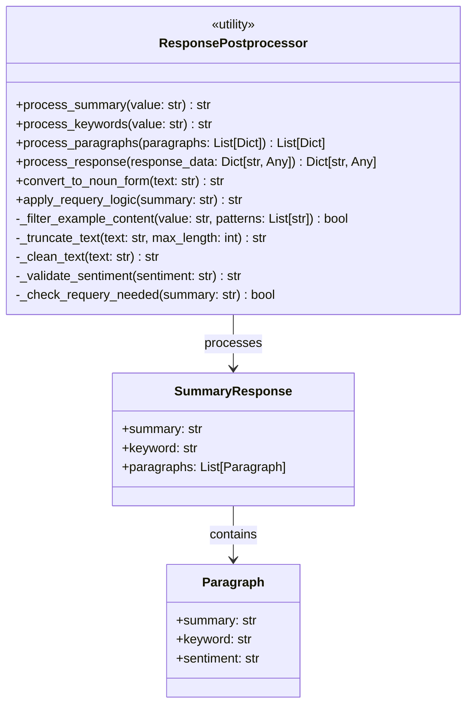
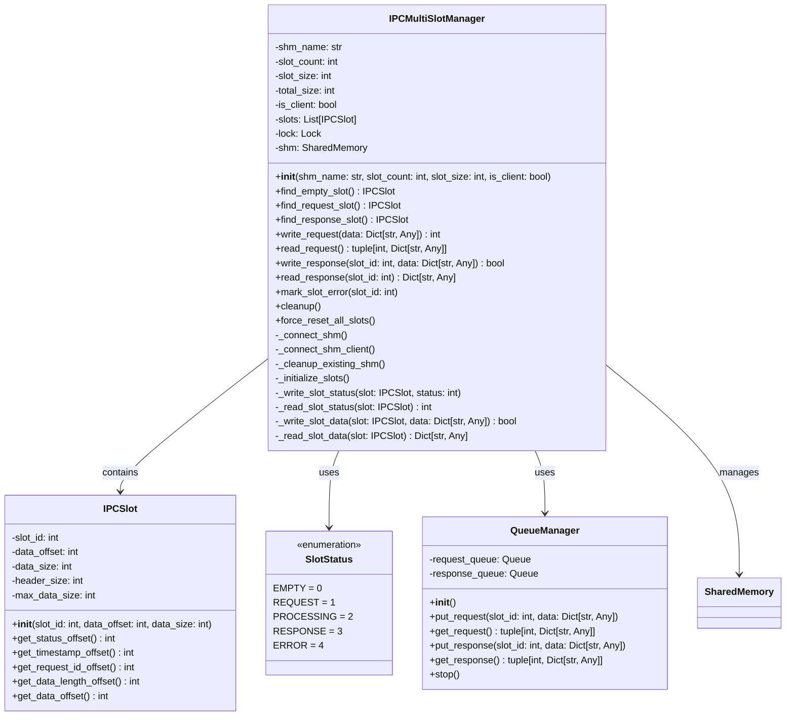
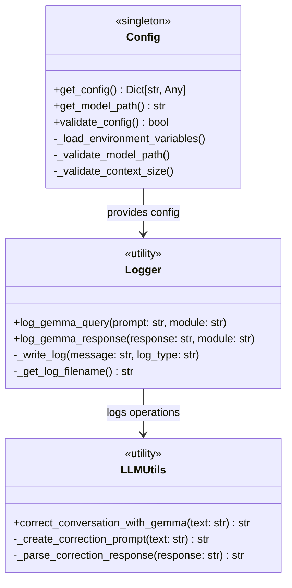
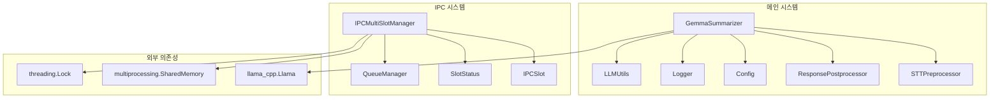
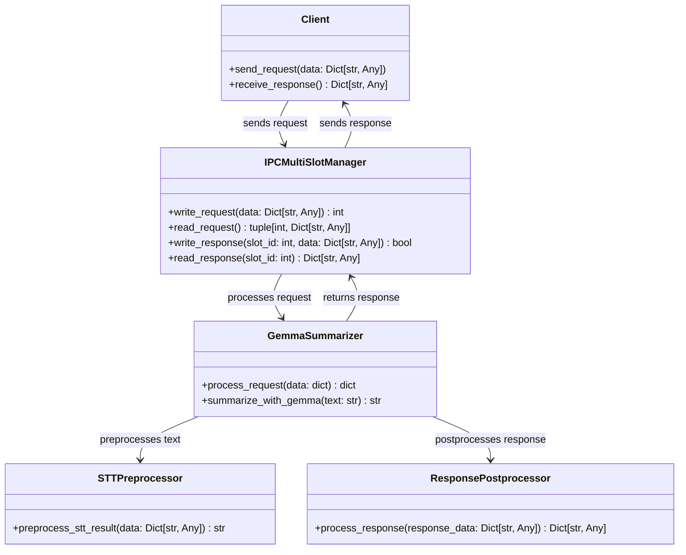

# 통화 요약 시스템 클래스 다이어그램

## 전체 시스템 클래스 다이어그램

```mermaid
classDiagram
    class GemmaSummarizer {
        -_llm_instance: Llama
        -_llm_lock: threading.Lock
        +get_llm_instance() Llama
        +summarize_with_gemma(text: str, max_tokens: int) str
        +process_request(data: dict) dict
        +resource_path(relative_path: str) str
    }

    class STTPreprocessor {
        +remove_duplicates(conversation_list: List[str]) List[str]
        +clean_text(text: str) str
        +preprocess_stt_result(data: Dict[str, Any]) str
        +extract_metadata(data: Dict[str, Any]) Dict[str, Any]
    }

    class ResponsePostprocessor {
        +process_summary(value: str) str
        +process_keywords(value: str) str
        +process_paragraphs(paragraphs: List[Dict]) List[Dict]
        +process_response(response_data: Dict[str, Any]) Dict[str, Any]
        +convert_to_noun_form(text: str) str
        +apply_requery_logic(summary: str) str
    }

    class IPCMultiSlotManager {
        -shm_name: str
        -slot_count: int
        -slot_size: int
        -total_size: int
        -is_client: bool
        -slots: List[IPCSlot]
        -lock: Lock
        -shm: SharedMemory
        +__init__(shm_name: str, slot_count: int, slot_size: int, is_client: bool)
        +find_empty_slot() IPCSlot
        +find_request_slot() IPCSlot
        +find_response_slot() IPCSlot
        +write_request(data: Dict[str, Any]) int
        +read_request() tuple[int, Dict[str, Any]]
        +write_response(slot_id: int, data: Dict[str, Any]) bool
        +read_response(slot_id: int) Dict[str, Any]
        +mark_slot_error(slot_id: int)
        +cleanup()
        +force_reset_all_slots()
    }

    class IPCSlot {
        -slot_id: int
        -data_offset: int
        -data_size: int
        -header_size: int
        -max_data_size: int
        +__init__(slot_id: int, data_offset: int, data_size: int)
        +get_status_offset() int
        +get_timestamp_offset() int
        +get_request_id_offset() int
        +get_data_length_offset() int
        +get_data_offset() int
    }

    class SlotStatus {
        <<enumeration>>
        EMPTY = 0
        REQUEST = 1
        PROCESSING = 2
        RESPONSE = 3
        ERROR = 4
    }

    class Config {
        +get_config() Dict[str, Any]
        +get_model_path() str
        +validate_config() bool
    }

    class Logger {
        +log_gemma_query(prompt: str, module: str)
        +log_gemma_response(response: str, module: str)
    }

    class LLMUtils {
        +correct_conversation_with_gemma(text: str) str
    }

    class JSONRepair {
        +extract_json_from_markdown(content: str) str
        +process_and_repair_json(json_str: str) str
        +extract_valid_data_from_broken_json(broken_json: str) str
    }

    class QueueManager {
        -request_queue: Queue
        -response_queue: Queue
        +__init__()
        +put_request(slot_id: int, data: Dict[str, Any])
        +get_request() tuple[int, Dict[str, Any]]
        +put_response(slot_id: int, data: Dict[str, Any])
        +get_response() tuple[int, Dict[str, Any]]
        +stop()
    }

    %% 관계 정의
    GemmaSummarizer --> STTPreprocessor : uses
    GemmaSummarizer --> ResponsePostprocessor : uses
    GemmaSummarizer --> Config : uses
    GemmaSummarizer --> Logger : uses
    GemmaSummarizer --> LLMUtils : uses
    GemmaSummarizer --> JSONRepair : uses

    IPCMultiSlotManager --> IPCSlot : contains
    IPCMultiSlotManager --> SlotStatus : uses
    IPCMultiSlotManager --> QueueManager : uses

    STTPreprocessor --> LLMUtils : uses
```

## 상세 클래스 다이어그램

### 1. GemmaSummarizer 클래스

### 2. STTPreprocessor 클래스

### 3. ResponsePostprocessor 클래스

### 4. IPC 시스템 클래스들

### 5. 설정 및 유틸리티 클래스들

## 클래스 관계 및 의존성

### 주요 의존성 관계

### 데이터 흐름 클래스 다이어그램

## 클래스 다이어그램 설명

### 1. GemmaSummarizer (싱글톤 패턴)
- **역할**: 전체 요약 시스템의 핵심 클래스
- **주요 기능**: 모델 관리, 요약 생성, 요청 처리
- **특징**: 싱글톤 패턴으로 모델 인스턴스 관리

### 2. STTPreprocessor (유틸리티 클래스)
- **역할**: STT 결과 전처리
- **주요 기능**: 화자 구분, 중복 제거, 텍스트 정리
- **특징**: 모든 메서드가 정적 메서드

### 3. ResponsePostprocessor (유틸리티 클래스)
- **역할**: 응답 후처리 및 필터링
- **주요 기능**: 3개 필드 처리 (summary, keyword, paragraphs), 동사→명사 변환, 재질의 로직
- **특징**: JSON 복구 시스템과 연동, 120byte 초과 시 재질의 적용

### 4. IPCMultiSlotManager (IPC 관리자)
- **역할**: 멀티슬롯 IPC 시스템 관리
- **주요 기능**: 공유 메모리 관리, 슬롯 할당, 데이터 전송
- **특징**: 동시 요청 처리 지원

### 5. IPCSlot (슬롯 클래스)
- **역할**: 개별 IPC 슬롯 관리
- **주요 기능**: 슬롯 오프셋 계산, 헤더 관리
- **특징**: 메모리 레이아웃 관리

### 6. Config (설정 관리)
- **역할**: 시스템 설정 관리
- **주요 기능**: 환경 변수 로드, 설정 검증
- **특징**: 싱글톤 패턴

### 7. Logger (로깅 시스템)
- **역할**: 요청/응답 로깅
- **주요 기능**: 파일 기반 로깅, 시간별 로그 관리
- **특징**: 비동기 로깅 지원

### 8. LLMUtils (LLM 유틸리티)
- **역할**: LLM 관련 공통 기능
- **주요 기능**: 대화 내용 보정, 텍스트 처리
- **특징**: 재사용 가능한 유틸리티 함수들

### 9. JSONRepair (JSON 복구 시스템)
- **역할**: JSON 파싱 오류 처리 및 복구
- **주요 기능**: 마크다운에서 JSON 추출, 잘린 JSON 복구, 구문 오류 수정
- **특징**: 다단계 복구 로직, aggressive 복구 모드 지원

이 클래스 다이어그램을 통해 통화 요약 시스템의 전체적인 구조와 각 클래스 간의 관계를 명확하게 이해할 수 있습니다. 