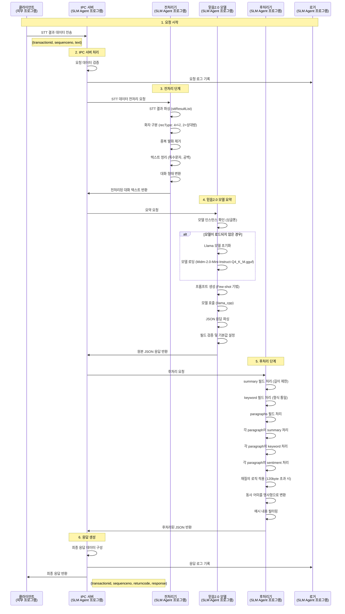
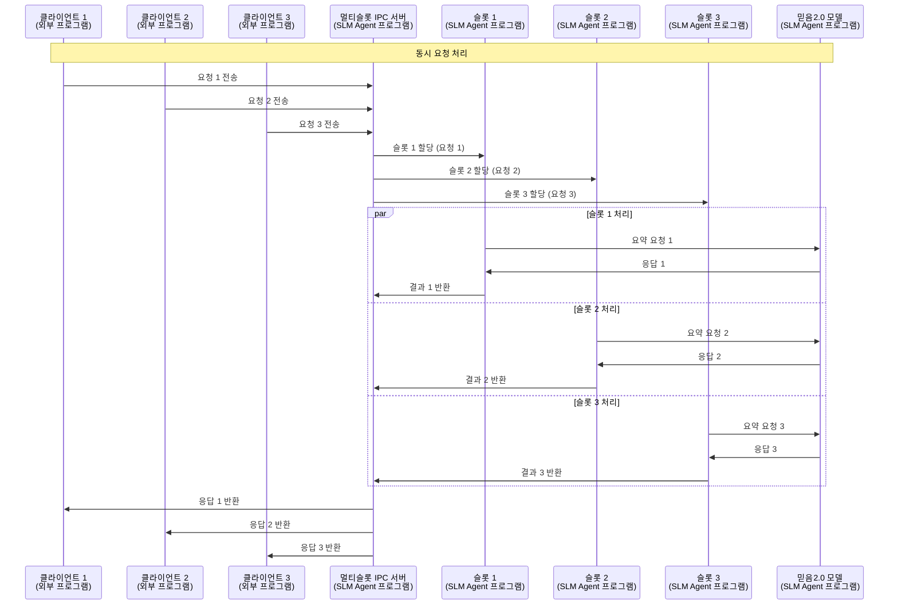
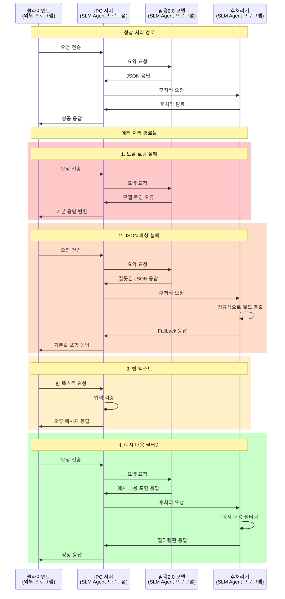
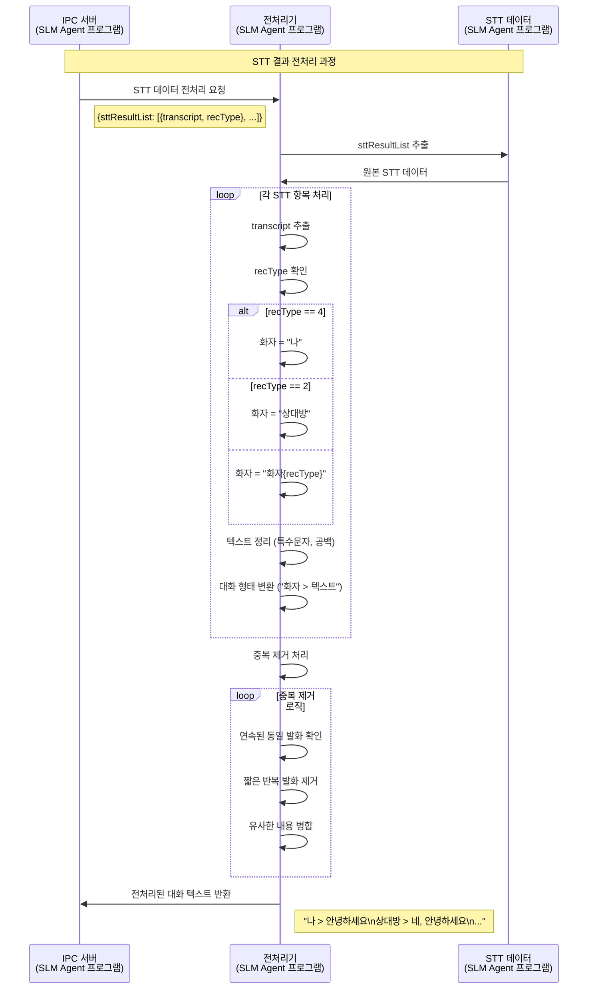
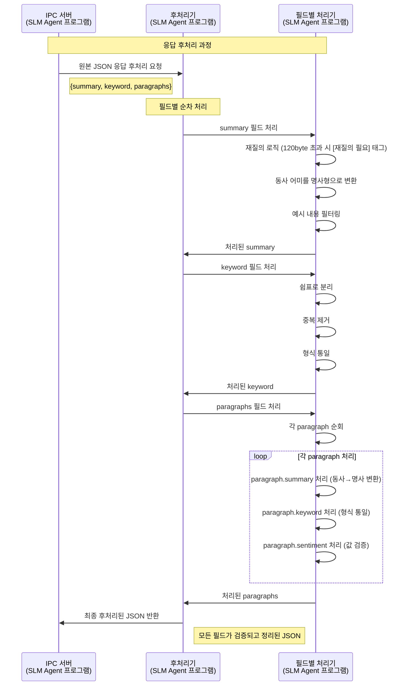

# 통화 요약 시스템 시퀀스 다이어그램

## 전체 시스템 시퀀스 다이어그램

## 멀티슬롯 IPC 시퀀스 다이어그램

## 에러 처리 시퀀스 다이어그램

## 상세 전처리 시퀀스 다이어그램

## 상세 후처리 시퀀스 다이어그램

## 시퀀스 다이어그램 설명

### 시스템 구성 요소 구분
- **외부 프로그램**: 클라이언트 - 요약 요청을 보내는 외부 애플리케이션
- **SLM Agent 프로그램**: 모든 내부 컴포넌트들
  - IPC 서버, 전처리기, 믿음2.0 모델, 후처리기, 로거
  - participant 라벨에 "(SLM Agent 프로그램)" 표시로 구분

### 1. 전체 시스템 시퀀스 다이어그램
- **6단계 처리**: 요청 시작 → IPC 서버 처리 → 전처리 → 믿음2.0 모델 → 후처리 → 응답 생성
- **각 컴포넌트의 역할**: 명확한 책임 분리와 데이터 흐름
- **로깅 시스템**: 요청/응답 로그 기록
- **시스템 경계**: 외부 클라이언트와 내부 프로그램 컴포넌트 명확 구분

### 2. 멀티슬롯 IPC 시퀀스 다이어그램
- **동시 처리**: 여러 클라이언트의 요청을 동시에 처리
- **슬롯 할당**: 각 요청을 별도 슬롯에 할당
- **병렬 처리**: 각 슬롯에서 독립적으로 요약 처리

### 3. 에러 처리 시퀀스 다이어그램
- **4가지 에러 시나리오**: 모델 로딩 실패, JSON 파싱 실패, 빈 텍스트, 예시 내용 필터링
- **Fallback 메커니즘**: 각 에러 상황별 대응 방안
- **색상 구분**: 에러 타입별 시각적 구분

### 4. 상세 전처리 시퀀스 다이어그램
- **STT 데이터 처리**: 원본 STT 결과를 대화 형태로 변환
- **화자 구분**: recType에 따른 화자 식별
- **중복 제거**: 다양한 중복 제거 로직

### 5. 상세 후처리 시퀀스 다이어그램
- **3개 필드 처리**: summary, keyword, paragraphs 필드별 전용 처리 로직
- **순차 처리**: 필드별 순서대로 처리
- **검증 및 정리**: 재질의 로직, 동사→명사 변환, 감정값 검증, 형식 통일

이 시퀀스 다이어그램들을 통해 통화 요약 시스템의 전체적인 데이터 흐름과 각 컴포넌트 간의 상호작용을 명확하게 이해할 수 있습니다. 