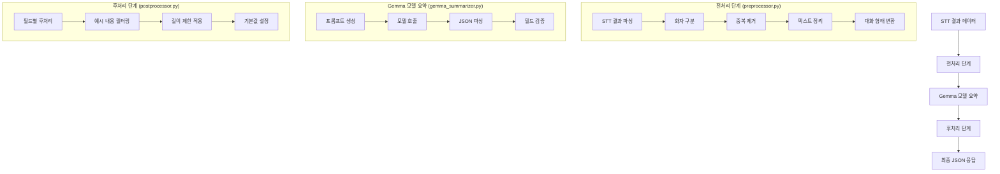
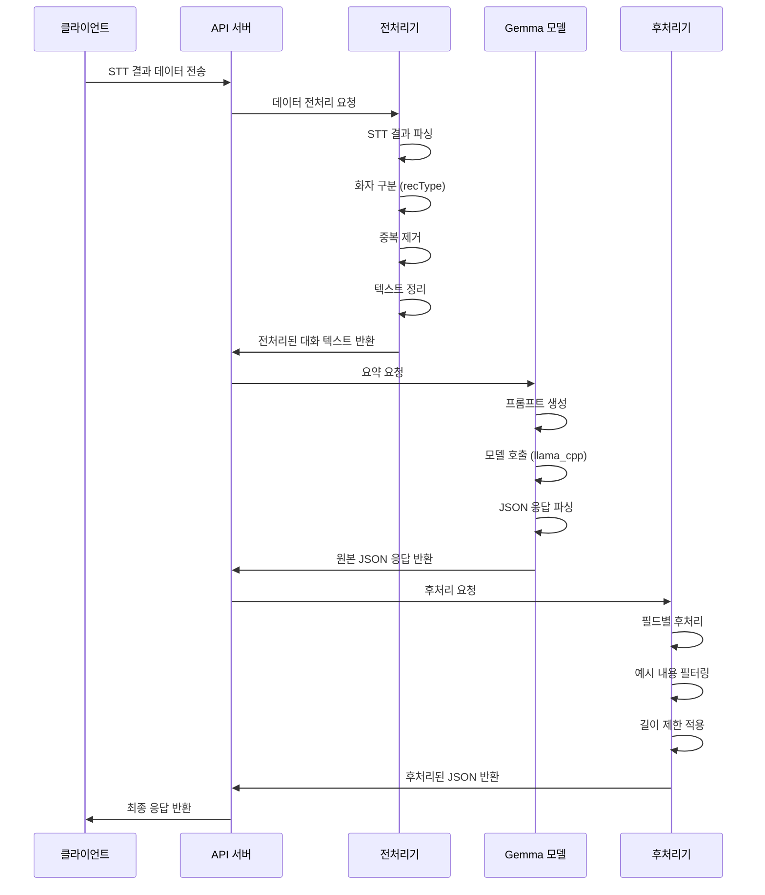
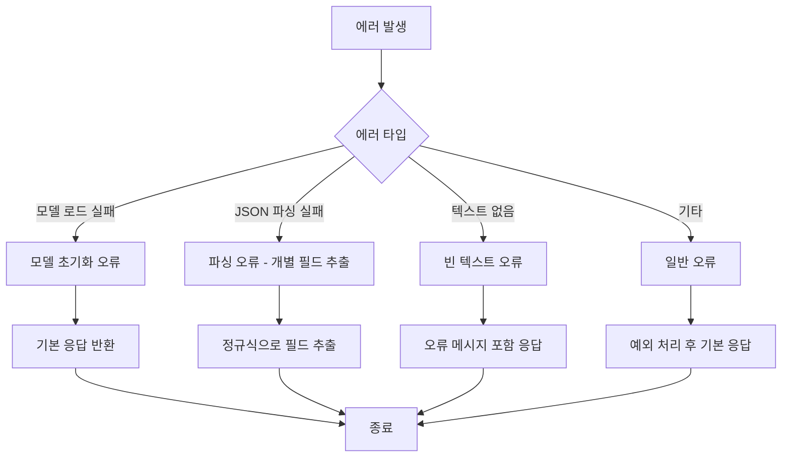

# 통화 요약 시스템 워크플로우

## 전체 시스템 아키텍처



## 상세 워크플로우

```mermaid
flowchart TD
    Start([요청 시작]) --> Input{입력 데이터 확인}
    Input -->|텍스트 없음| Error1[오류 응답 반환]
    Input -->|텍스트 있음| Preprocess[전처리 시작]
    
    Preprocess --> ParseSTT[STT 결과 파싱]
    ParseSTT --> SpeakerSep[화자 구분]
    SpeakerSep --> RemoveDup[중복 제거]
    RemoveDup --> CleanText[텍스트 정리]
    CleanText --> ConvFormat[대화 형태 변환]
    
    ConvFormat --> LoadModel{모델 로드 확인}
    LoadModel -->|모델 없음| InitModel[모델 초기화]
    LoadModel -->|모델 있음| CreatePrompt[프롬프트 생성]
    InitModel --> CreatePrompt
    
    CreatePrompt --> CallGemma[Gemma 모델 호출]
    CallGemma --> ParseJSON[JSON 응답 파싱]
    ParseJSON --> ValidateFields{필드 검증}
    
    ValidateFields -->|파싱 실패| ExtractFields[개별 필드 추출]
    ValidateFields -->|파싱 성공| PostProcess[후처리 시작]
    ExtractFields --> PostProcess
    
    PostProcess --> ProcessSummary[summary 필드 처리]
    ProcessSummary --> ProcessSummaryNoLimit[summary_no_limit 필드 처리]
    ProcessSummaryNoLimit --> ProcessKeywords[keywords 필드 처리]
    ProcessKeywords --> ProcessPurpose[call_purpose 필드 처리]
    ProcessPurpose --> ProcessMyContent[my_main_content 필드 처리]
    ProcessMyContent --> ProcessCallerContent[caller_main_content 필드 처리]
    ProcessCallerContent --> ProcessMyEmotion[my_emotion 필드 처리]
    ProcessMyEmotion --> ProcessCallerEmotion[caller_emotion 필드 처리]
    ProcessCallerEmotion --> ProcessCallerInfo[caller_info 필드 처리]
    ProcessCallerInfo --> ProcessAction[my_action_after_call 필드 처리]
    
    ProcessAction --> FinalJSON[최종 JSON 생성]
    FinalJSON --> Success[성공 응답 반환]
    
    Error1 --> End([종료])
    Success --> End
```



## 데이터 흐름



## 주요 컴포넌트 설명

### 1. 전처리기 (preprocessor.py)
- **STT 결과 파싱**: `sttResultList`에서 대화 내용 추출
- **화자 구분**: `recType`에 따라 "나"(4), "상대방"(2) 구분
- **중복 제거**: 연속된 동일 발화, 짧은 반복 발화 제거
- **텍스트 정리**: 특수문자, 불필요한 공백 제거

### 2. Gemma 요약기 (gemma_summarizer.py)
- **모델 관리**: 싱글톤 패턴으로 Llama 모델 인스턴스 관리
- **프롬프트 생성**: Few-shot 기법을 이용한 구조화된 프롬프트
- **JSON 파싱**: 다양한 형태의 JSON 응답을 안정적으로 파싱
- **필드 검증**: 필수 필드 확인 및 기본값 설정

### 3. 후처리기 (postprocessor.py)
- **필드별 처리**: 각 필드에 맞는 전용 처리 로직
- **예시 내용 필터링**: 프롬프트의 예시 내용이 실제 응답으로 처리되는 것 방지
- **길이 제한**: summary(30자), call_purpose(20자) 등 제한 적용
- **기본값 설정**: 누락된 필드에 대한 기본값 제공

## 출력 JSON 구조

```json
{
  "summary": "30자 이내 핵심 요약",
  "summary_no_limit": "상세한 통화 내용 요약",
  "keywords": "키워드1, 키워드2, 키워드3, 키워드4, 키워드5",
  "call_purpose": "20자 이내 통화 목적",
  "my_main_content": "나의 주요 발언 내용",
  "caller_main_content": "상대방 주요 발언 내용",
  "my_emotion": "보통/만족/불만/화남/신남/우려",
  "caller_emotion": "보통/만족/불만/화남/신남/우려",
  "caller_info": "상대방 신상 정보",
  "my_action_after_call": "통화 후 할 일"
}
```

## 에러 처리

